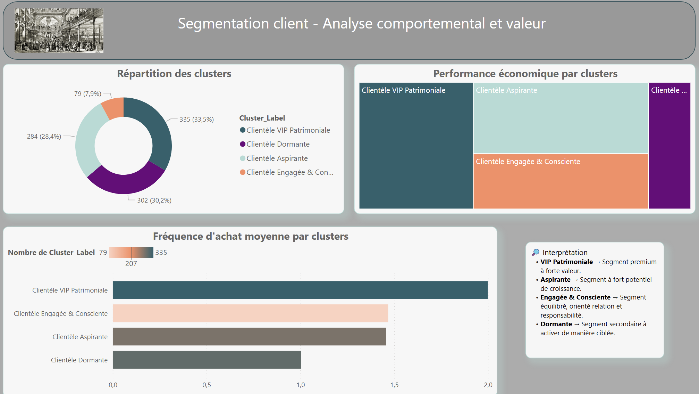
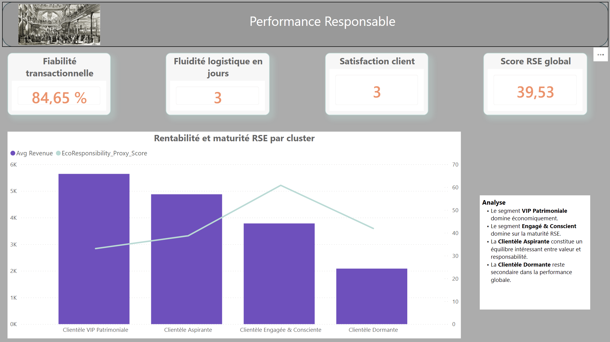
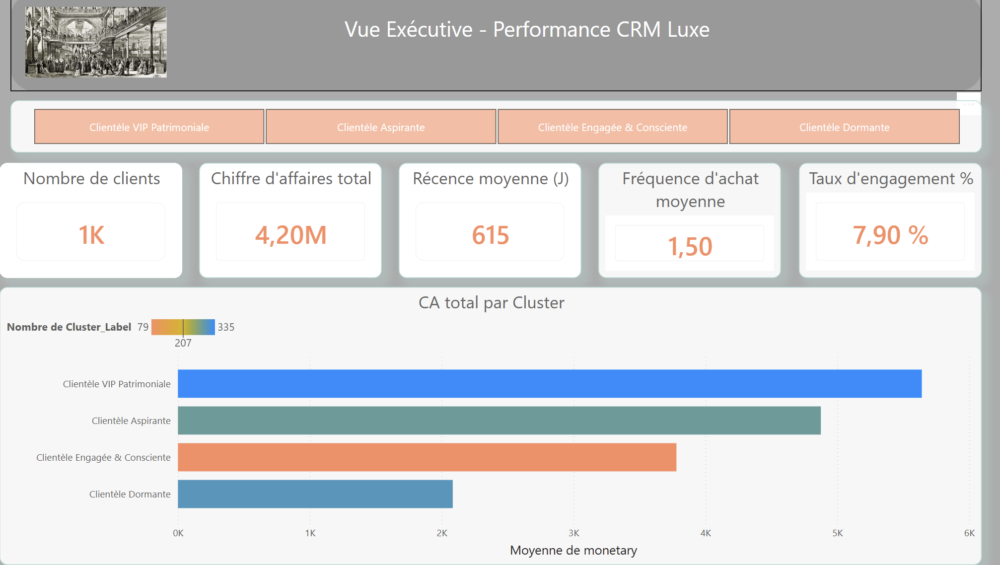
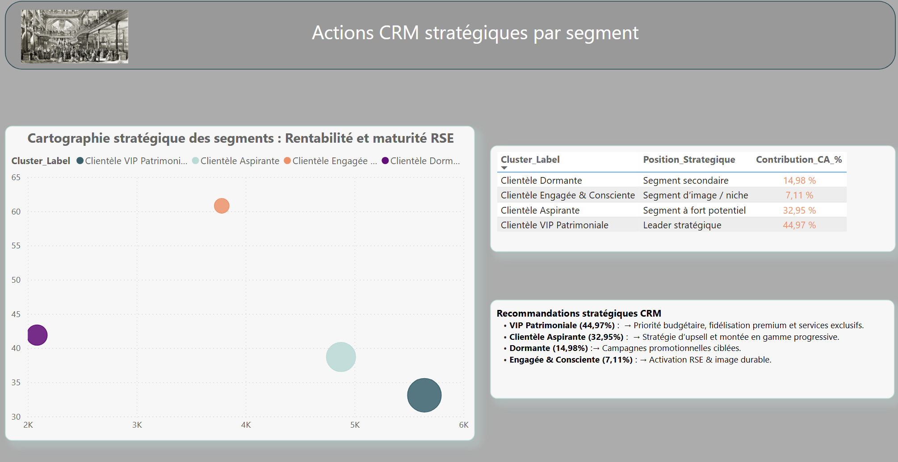

# 🛍️ Customer Segmentation for CRM Optimization

## 🎯 Objective

The goal of this project is to analyze customer behavior and build a segmentation model to improve CRM targeting and increase customer lifetime value.

---

## 📊 Dataset

Retail transactional dataset including:

* 👤 Customers
* 🛒 Orders
* 📦 Products
* 💳 Payments

---

## ⚙️ Tools & Technologies

* **Python** (Pandas, NumPy, Scikit-learn)
* **SQL**
* **Power BI**

---

## 🔍 Analysis Workflow

### 1. Data Preparation

* Data cleaning and preprocessing
* Handling missing values
* Feature engineering

### 2. Feature Engineering

Creation of behavioral metrics:

* Recency (days since last purchase)
* Frequency (number of purchases)
* Monetary value (total spend)
* Average order value
* Customer engagement indicators

### 3. Modeling

* Standardization of features
* K-Means clustering
* Elbow method to determine optimal number of clusters
* Final segmentation into **4 customer groups**

---

## 👥 Customer Segments

### 🟣 Cluster 0 — High-value customers

* High monetary value
* High purchase frequency
* Strong CRM potential

### 🔴 Cluster 1 — Inactive / at-risk customers

* High recency (long time since last purchase)
* Low frequency
* Require reactivation strategies

### 🔵 Cluster 2 — Moderate regular customers

* Balanced spending and frequency
* Good candidates for upsell

### ⚪ Cluster 3 — Low-engagement customers

* Low spending and interaction
* Price-sensitive or occasional buyers

---

## 📊 Results & Dashboard

### 📍 Customer Segmentation Overview



### 💰 Revenue & Cluster Performance



### 🌍 Executive CRM View



### 🎯 Strategic CRM Actions



👉 The project includes an **interactive Power BI dashboard** providing a business-oriented view of customer segments, performance, and strategic recommendations.

---

## 💡 Key Insights

* Identification of high-value customers driving revenue
* Detection of churn-risk segments
* Clear behavioral differences between customer groups
* Opportunity to personalize CRM strategies

---

## 📈 Business Impact

* Improved CRM targeting
* Personalized marketing campaigns
* Increased customer retention
* Potential uplift in campaign performance

---

## 🚀 Recommendations

* 🎯 Loyalty programs for high-value customers
* 🔁 Win-back campaigns for inactive users
* 💰 Upsell strategies for moderate customers
* 📉 Cost-efficient targeting for low-engagement segment

---

## 📂 Project Structure

```bash
.
├── segmentation_analysis.ipynb
├── dashboard/
│   ├── segmentation.png
│   ├── performance.png
│   ├── overview.png
│   └── strategy.png
├── requirements.txt
└── README.md
```

---

## 👤 Author

**Marième Thiam**
Data Analyst | Retail & CRM

